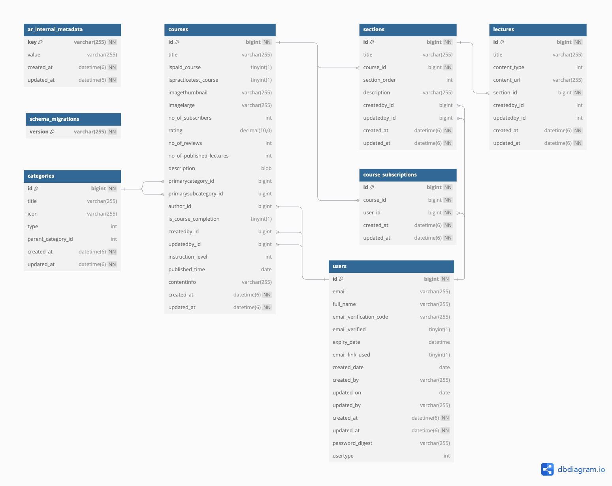

# Project Limeo: Learn Fresh, Learn Fast

## Short Description
Limeo is an online learning platform where users can subscribe to courses, engage in learning activities, and track their progress efficiently. The project prioritizes performance and user experience with robust features and efficient data handling.

## Features
- **User Module**:
    - User registration
    - Login
    - Email verification
- **Course Management**:
    - Users can subscribe to courses.
    - Manage sections and lectures within courses.
- **Mailing Functionality**:
    - Asynchronous and synchronous mailing for notifications and updates.
- **Session Management**:
    - Active session tokens are maintained using Redis for scalability and efficiency.

## Resources
- **ER Diagram**: Available in `ER-Diagram.png`.
- **Postman Collection**: Includes all API endpoints for testing and integration.

## Getting Started
Follow the setup instructions to deploy and run the application locally or on a server.

## ER Diagram
Below is the Entity-Relationship diagram for the database schema:



## Postman Collection
The API endpoints for this project can be tested using the Postman collection provided in `sample app.postman_collection.json`.
## Project Assets
- **ER Diagram**: Refer to `ER-Diagram.png` to understand the database structure and relationships.
- **Postman Collection**: The API endpoints are documented in the Postman collection file included in the repository.

## Setup Instructions
1. **Clone the Repository**:
   ```bash
   git clone <repository-url>
   cd limeo
   ```

2. **Install Dependencies**:
   ```bash
   bundle install
   ```

3. **Database Setup**:
   ```bash
   rails db:create db:migrate db:seed
   ```

4. **Run Redis** (if not already running):
   ```bash
   redis-server
   ```

5. **Start the Server**:
   ```bash
   rails server
   ```

6. **Access the Application**:
   Open your browser and navigate to `http://localhost:3000`.

## API Documentation
- The Postman collection provided includes all available endpoints. Import it into Postman for testing and exploration.

## Contributing
Feel free to contribute to Limeo by submitting pull requests or raising issues.

## License
This project is licensed under the [MIT License](LICENSE).

---

